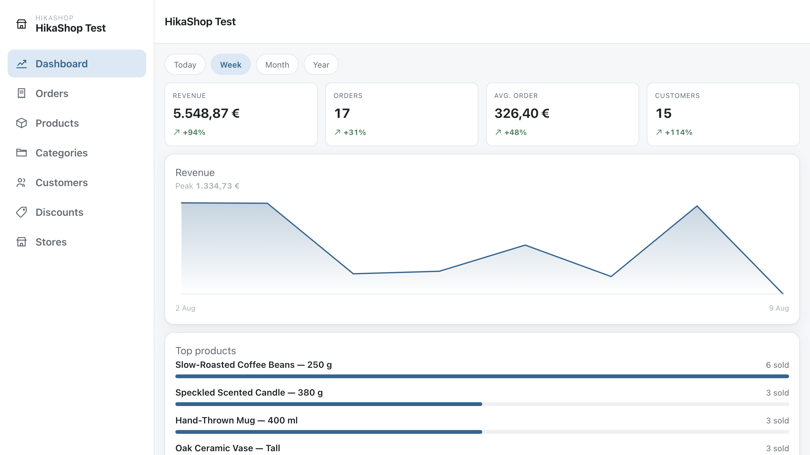
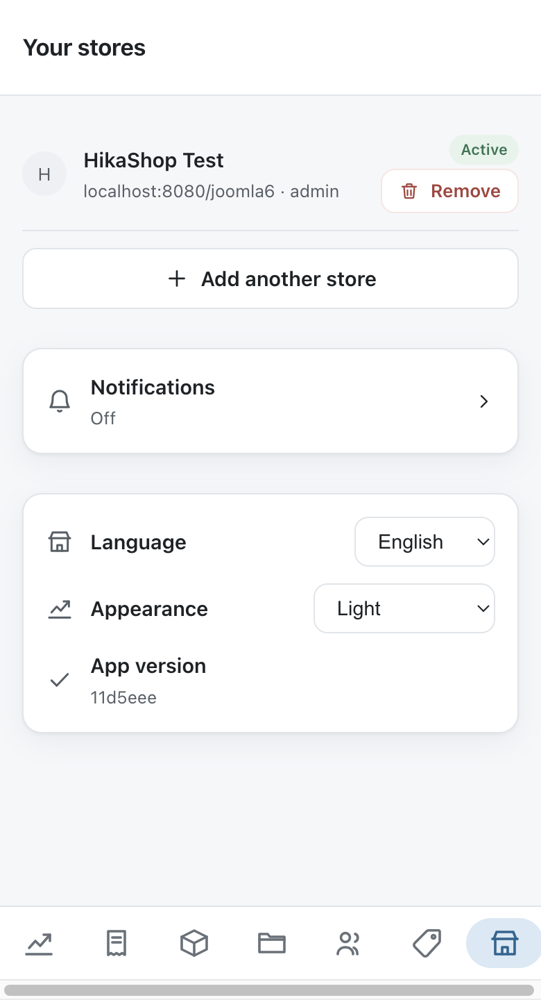
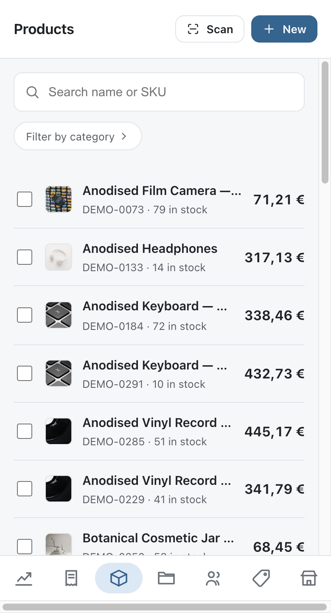
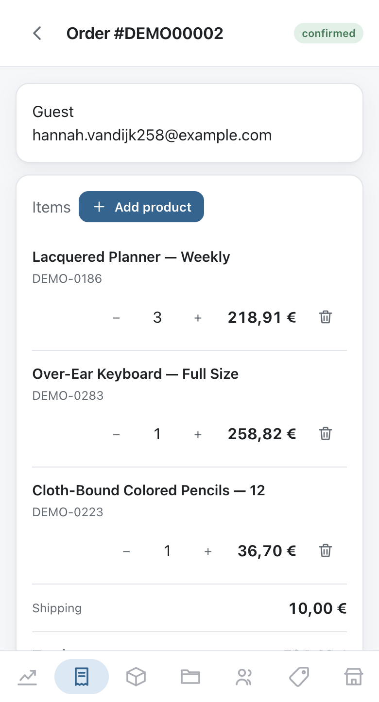
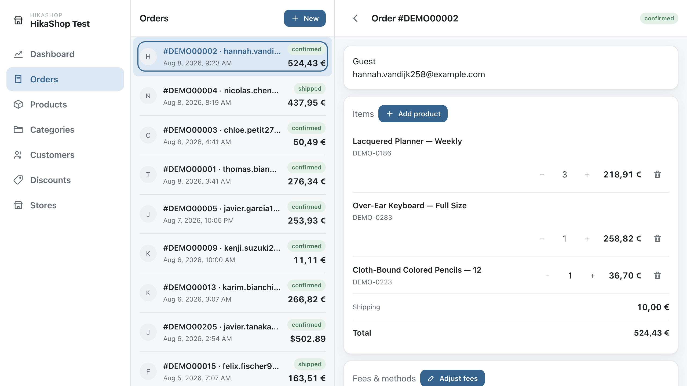
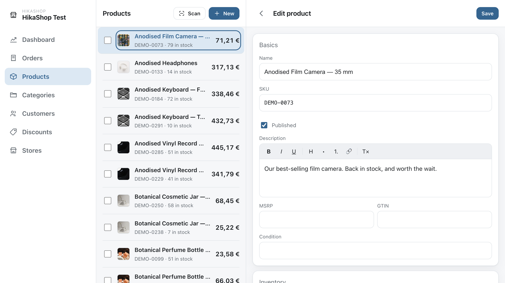

# HikaShop mobile

Run your [HikaShop](https://www.hikashop.com) shop from a phone, a tablet or a browser. Follow
your sales, deal with your orders, and keep your catalogue up to date without opening the
Joomla or WordPress backend.

The app talks to your own shop directly. There is no account to create, no service in the
middle, and nothing about your shop is kept anywhere except on your server and on your device.

## What people use it for

### I look after several shops and I want them in one place

Connect as many shops as you like and switch between them from the top of the menu. Each keeps
its own key and remembers its own filters and searches, so moving between them is one tap and
you come back to a shop as you left it.

They can sit on different servers, on Joomla and on WordPress, in different languages and in
different currencies. Every price is shown in the currency that shop actually uses, rounded the
way that shop rounds it.

### I want to know as soon as an order comes in

Turn notifications on and the app watches the shop you have open, raising a notification with
the order number, the customer and the total, and a short chime for a sale. Tap it and you are
looking at the order.

You decide what is worth interrupting you for: new orders, stock running low, or both, and at
which stock level. Those choices are yours rather than each shop's, so you set them once and
they hold wherever you are.

Worth being straight about how it works, because it changes what you should expect. The app
asks your shop every thirty seconds; your shop does not push to the app. While the app is open,
or left open on a counter tablet or an office screen, you hear about a sale within half a
minute. Once a phone puts the app to sleep, Android decides how often anything may run in the
background, which is usually every fifteen minutes or so. If you want a screen that tells you
the moment a sale lands, leave the app open on it.

### I want to fix stock without hunting for the product

Press **Scan**, point the camera at the barcode on the box, and the product comes up with its
stock ready to change. Type the new figure, save, done. It works with a barcode reader too, the
sort that plugs in and types for you, so a tablet by the stockroom door becomes a stock
terminal.

No camera and no reader? Type the barcode, the SKU or the name. The product list shows what is
in stock for everything as you scroll, so a quick count down a shelf needs no scanning at all.

For a batch at once, any mass action you have set up in your backend appears in the app: tick
the products, choose the action, and it runs on your shop exactly as it would there.

|  |  |
| --- | --- |
|  |  |

### My client wants something simpler than the Joomla backend

The backend shows a shop owner everything Joomla and HikaShop can do. Most days they need a
small part of it, and finding that part is the hard bit.

The app is that part: orders, products, categories, customers, discounts, and what sold this
week. Big enough to tap, on a phone they already carry, in English or French.

It also keeps to what you have already decided for them. What each person may see and change
comes from the access levels of your Joomla or WordPress site and the **Access levels** tab of
the HikaShop configuration, so an assistant paired with their own device gets the shop you gave
them and nothing more. You can revoke that one device from the backend the day they hand the
phone back, without touching anybody else's.

|  |  |
| --- | --- |
|  |  |

## Everything it does

- **Orders.** Read, search and filter them, change the status, edit the addresses, the products
  and the shipping and payment fees, or write an order by hand for a customer on the phone.
- **Products.** Full editing: images, prices, variants, characteristics, related products,
  files and your own custom fields. Crop, zoom and rotate an image before attaching it.
- **Categories, customers, discounts and coupons.**
- **Translations** of what you sell. On a multilingual shop, the name, the description and your
  translatable custom fields of a product or a category can be written in each of your languages
  without leaving the app.
- **A dashboard** of revenue, orders, average basket and customers, by day, week, month or
  year, with your best sellers.
- **Notifications** for new orders and for stock running low.
- **Barcodes**, by camera or by reader.
- **Your own mass actions**, exactly as they are configured in your backend.
- **Several shops**, switched from the menu.

On a computer, press `Cmd`/`Ctrl`+`K` for the command palette, or `?` for the shortcuts.

## In your own language

The app is offered in every language HikaShop is translated into, fifty-eight of them counting the
regional variants, and it starts in the one your phone or your browser is set to. An Austrian gets
Austrian German rather than German. You can pick another on the shops screen, and it stays picked
on that device.

What your shop calls things comes from your shop. Order statuses, the labels of your custom fields
and the wording of your address forms are read from the HikaShop translation installed on that
site, so they read as they do in your backend rather than being translated a second time here.

Two of them, Armenian and Kazakh, have not been checked by a native speaker yet, as
[docs/languages.md](docs/languages.md) notes. If one is yours and something reads badly,
[tell us](../../issues); a correction is a few lines in a file and no code at all.

## What you need

- **HikaShop Business 6.6.0 or newer**, on Joomla or on WordPress. The app talks to a plugin
  that ships inside the Business package, so Essential and Starter shops do not answer it.
- **HTTPS on your shop.** Connecting sends a one-time code, the reply carries this device's own
  key, and every request afterwards carries it too. A shop served over plain `http://` exposes
  that key to anyone on the same network.

## Getting it

- **Android:** get it on
  [Google Play](https://play.google.com/store/apps/details?id=com.hikashop.app). If you would
  rather not go through the store, the same build is on the
  [latest release](../../releases/tag/android-latest) as an APK; Android will warn you about
  installing from outside the Play Store.
- **Computer, or any browser:** open the
  [web version](https://hikashop-nicolas.github.io/hikashop-mobile/). It installs as a normal
  app from your browser's menu and behaves the same as the Android one.

## Connecting it to your shop

1. In your shop's backend, open **System > App Devices** and add a device.
2. A QR code appears. It lasts a few minutes and works once.
3. Scan it with the app, or type the code in by hand.

Your password is never typed into the app: the app is given a key of its own. Every device you
connect is listed in the backend with the date it was last used, and each can be revoked
separately, which is what you do when a phone is lost or somebody leaves.

## Your data

The app keeps your shop's address and one key per shop, on the device, in the phone's secure
storage on Android. Nothing is sent anywhere except to your own shop. There is no analytics of
any kind, no account, and nobody in the middle.

## Something wrong, or missing?

Bugs and ideas go in the [issues](../../issues). For help with HikaShop itself, the
[HikaShop forum](https://www.hikashop.com/forum.html) will get you a faster answer than we can
here.

## For developers

Building it, the test suites and the accessibility work are in
[docs/development.md](docs/development.md).

The app is GPL-3.0-or-later, the same licence as HikaShop and as Joomla. See
[LICENSE](LICENSE).
